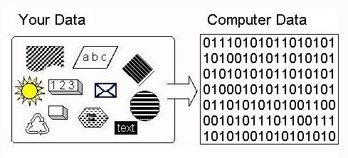
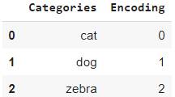
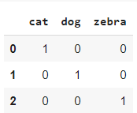

[Jyothi Prakash](https://jyothiprakashpanaik.github.io/porfolio/) Oct 17, 2020 . 5 min read

---

>Categorical encoding is a process of converting categories to numbers.


<center>
<span>* * *</span>
</center>

*To begin with you can find the sklearn documentation [here](https://scikit-learn.org/stable/modules/classes.html#module-sklearn.preprocessing)*

### What is Categorical Encoding?

In the dataset converting categorical columns to numerical columns so that a machine learning algorithm understands it. This process is called categorical encoding.



### Types of categorical Encoding

“Cat”, “Dog” or “Zebra” are called categorical variables. Many machine learning algorithms are unable to work with categorical variables. In such a case we should encode these variables! How? There are a few ways.

There are many ways to hande categorical data., most popular are :
+ **Label Encoding**
+ **One Hot Encoding**

***

## Label Encoding


Label Encoding is a popular encoding technique for handling categorical variables.
In Label Encoding ***every categor***y is given a ***unique value*** of integer based upon the alphabitical series.,
`cat=0`,`dog=1`,`zebra=2`.

## Code


``` python
#Label Encoding

import pandas as pd
df = pd.DataFrame({'Categories':['cat','dog','zebra']}) 

from sklearn.preprocessing import LabelEncoder
label_encoder = LabelEncoder() 
df['Encoding']= label_encoder.fit_transform(df['Categories']) 

print(df)
```

#### _output_:



## One Hot Encoding


In One Hot Encoding, we use as many columns as the number of classes we want to encode. Notice, that we no longer have any built-in assumptions about our classes (as we did have with Label Encoding).

In a neural network, using One Hot Encoding, the output layer would have exactly 3 output neurons.

`cat=1,0,0`,`dog=0,1,0`,`zebra=0,0,1`
## Code


``` python
#one hot encoding
import pandas as pd
import numpy as np
from sklearn.preprocessing import OneHotEncoder

df = pd.DataFrame({'Categories':['cat','dog','zebra']}) 

enc = OneHotEncoder(handle_unknown='ignore')
enc_df = pd.DataFrame(enc.fit_transform(df[['Categories']]).toarray())
df = df.join(enc_df)
print(df)

# alternative for one hot encoding
'''
df = pd.DataFrame({'Categories':['cat','dog','zebra']}) 
df = pd.get_dummies(df['Categories'])
print(df)

'''

```

#### _output_:



>[For reference you can Follow this link it will redirect to the scource code.](https://colab.research.google.com/drive/1YSe1Iqfk7yD6I-z2jSsEZ6z14mM8wPyp?usp=sharing)

---
# Reference:
1. [sklearn-documentation](https://scikit-learn.org/)
2. [Youtube](https://www.youtube.com/channel/UCNU_lfiiWBdtULKOw6X0Dig)
3. [Stodolkiewicz](https://www.stodolkiewicz.com)
